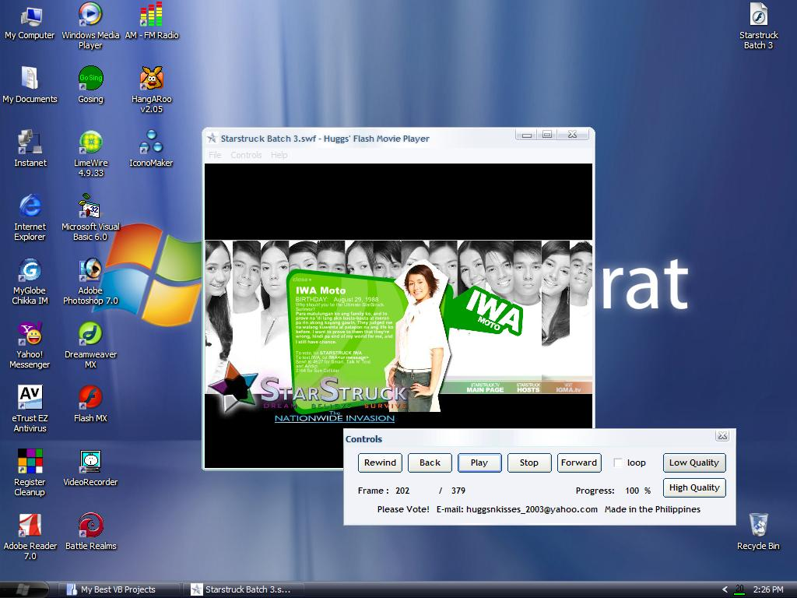



## Huggs' Shockwave Flash Movie Player 1\.0\.4 Updated

### Description

It's just the same as my first release. the new features is i separate the controls to the main form. now you can resize the main form. I still updating for the final version. Please vote!
 
### More Info
 

             |
---                |---
**Submitted On**   |2005-12-14 09:30:46
**By**             |[John Aso](https://github.com/Planet-Source-Code/PSCIndex/blob/master/ByAuthor/john-aso.md)
**Level**          |Beginner
**User Rating**    |3.7 (11 globes from 3 users)
**Compatibility**  |VB 6\.0
**Category**       |[Miscellaneous](https://github.com/Planet-Source-Code/PSCIndex/blob/master/ByCategory/miscellaneous__1-1.md)
**World**          |[Visual Basic](https://github.com/Planet-Source-Code/PSCIndex/blob/master/ByWorld/visual-basic.md)
**Archive File**   |[Huggs'\_Sho19572612172005\.zip](https://github.com/Planet-Source-Code/john-aso-huggs-shockwave-flash-movie-player-1-0-4-updated__1-63686/archive/master.zip)

